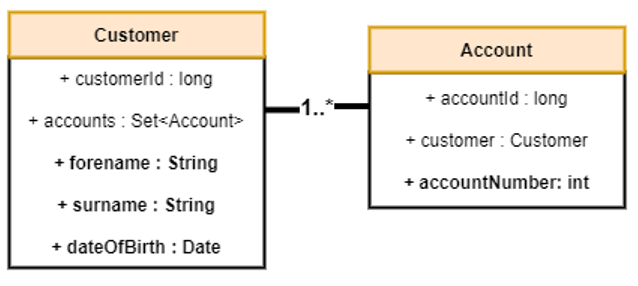

# Phoebus Software Ltd technical test

This application is a Spring Boot 2.5.x application designed to simulate a simple web API for an account and customer.

There are no restrictions for this exercise - feel free to google, use stackoverflow etc.

## Scenario: Know Your Customer
Within the banking industry we need to validate customer details against source systems to ensure a customer is who they say they are.
For administrators we would require lookups to validate customer details. We might also need to validate that front-end input matches back-end business logic.
Using Spring Boot and a database technology of your choice, create a new RESTful API with end points to carry out the following functions

## Step one

#### Figure 1 (all fields marked in bold are mandatory):

Please add the missing fields to the project including validation for the fields marked in bold.

Implement a One-to-Many relationship between Account and Customer. A customer can have many accounts.

## Step two
Update/add the appropriate endpoints for the following scenarios:
 - Add a new account
 - Add a new customer
 - Retrieve all accounts for a given customer

## Step three

Explain how this service could be made production ready;

 - What would you do to ensure the service is robust and scalable?
 - What would you do to ensure the service is secure?
 - What would you do to ensure the service is observable?
 - What would you do to ensure the service is deployable?
